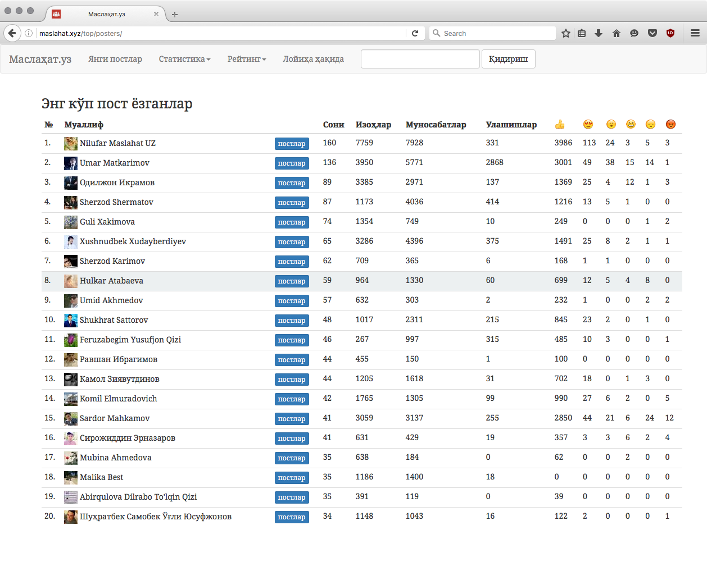

# Maslahat.uz
Фейсбукдаги "Маслаҳат.уз" гуруҳи учун махсус лойиҳа

Онлайн демо версия: http://maslahat.xyz

## Лойиҳадан мақсад
Гуруҳ фаолиятини хронологик тарзда кўрсатиб бериш, гуруҳ иштирокчилари томонидан ёзилаётган постлар ва изоҳлар, уларга бўлаётган бошқа иштирокчиларнинг муносабатларини (лайк қўйиш, улашиш ва ҳ.к) статистикасини реал вақтда Фейсбукдаги маълумотлар асосида олиб бориш, гуруҳ фаолиятига умумий назар солиб таҳлил қилишга кўмаклашиш.

## Лойиҳани серверга ўрнатиш учун йўриқнома
### Талаблар

  1. Python дастурлаш тили 3.5 версияси
  2. Django веб фреймворки 1.10 версияси
  3. Postgresql маълумотлар базаси 9.5 версияси
  4. Redis структурали маълумотлар сервери 3.2 версияси

### Ўрнатиш тартиби

Facebook developer консолидан `FACEBOOK_APP_ID` ва `FACEBOOK_APP_SECRET` ни
билиб олинг. Гуруҳнинг Фейсбукдаги идентификатори `1601597320127277`.

Қуйидаги буйруқларни кетма-кетликда бажаринг.

  1. `git clone https://github.com/muminoff/maslahat.git`
  2. `virtualenv env && source env/bin/activate.sh`
  3. `pip install -r requirements.txt`
  4. `createuser -s maslahat`
  5. `createdb -O maslahat maslahat`
  6. `python manage.py migrate`
  7. `python manage.py collectstatic --noinput`
  8. `python manage.py import`
  9. `python manage.py runserver`

### Disclaimer
Ушбу лойиҳа серверга ўрнатилганидан сўнг, ушбу сайтдаги ҳар қандай мазмунга эга
бўлган контент учун фақат гуруҳ админлари ва пост муаллифлари жавобгардир.

### Лицензия (License)
Лойиҳанинг код қисми GPL лицензияга эга.
